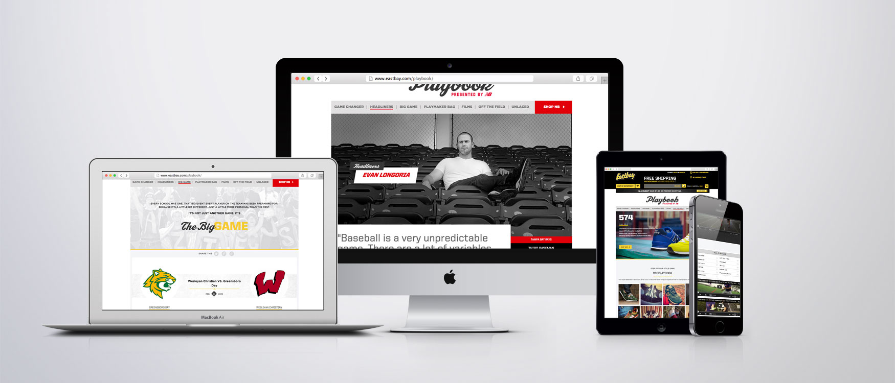
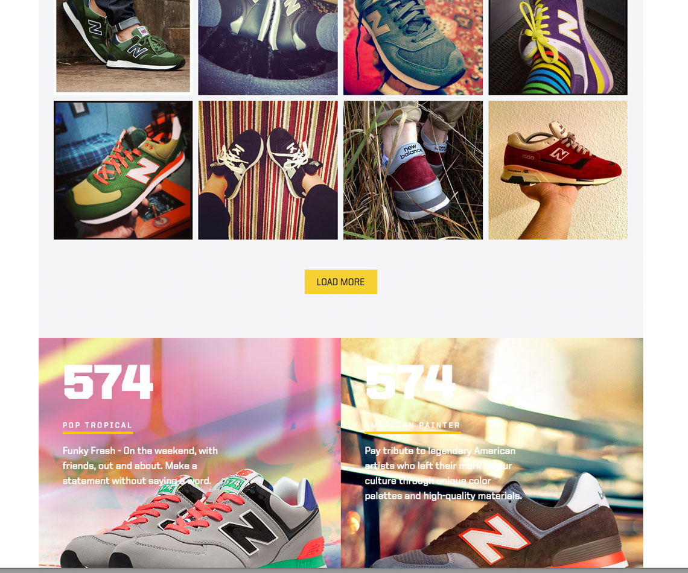
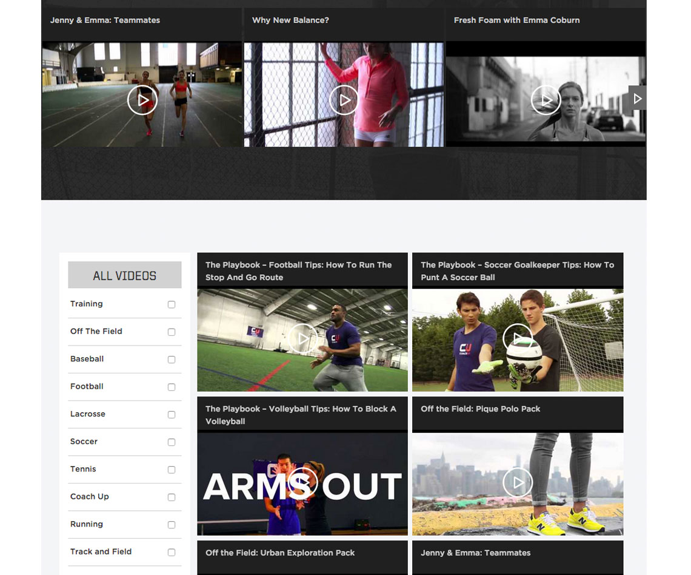

New balance partnered with Eastbay on multiple occasions in order to promote and sell new shoes. The Playbook campaign ran for about 3 months as new products became available for the season. It featured promotional videos, famous athlete profiles and new product description pages.

This campaign was developed in WordPress with an iFrame method.

- Development platform: WordPress
- Design: Designed by Almighty 
- Hosting provider: Eastbay proprietary AWS servers  
- Project lifecycle: 3 months 

