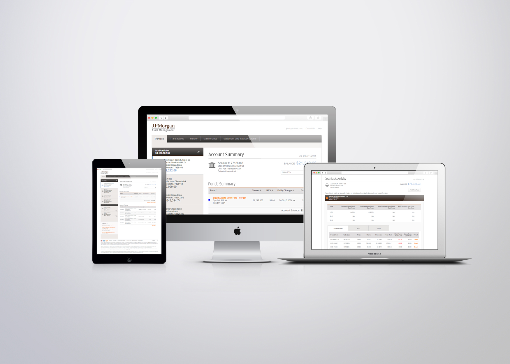
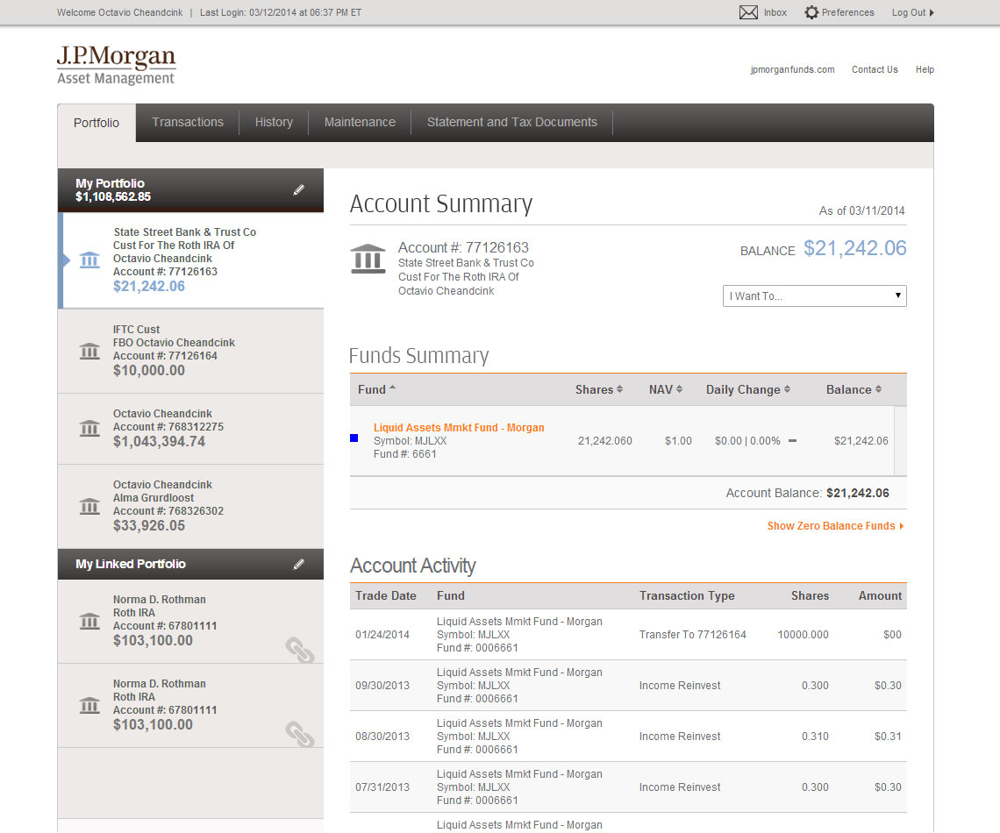
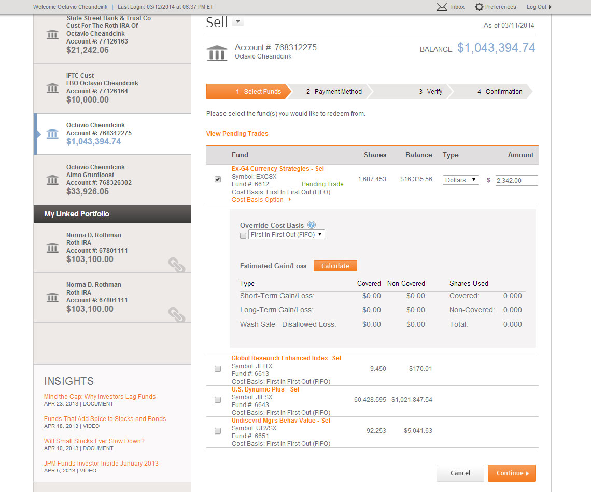

One of two major clients that was handled by Boston Financial Data Services web development division. My job as the front-end developer was to work closely with the designers in creating prototype UI elements and pages for different user scenarios within ROTH accounts.

A lot of the work was done using pure HTML, CSS, JavaScript (mostly jQuery). A lot of the technology predates the use of our current modern front-end framework tools (React, Angular, Vue).

- Development platform: Internal Boston Financial Data Services web environments  
- Design: UI Elements by in-house designer at Boston Financial Data Services  
- Hosting provider: DST Servers  
- Project lifecycle: 9+ months  
- Website link: Internal project  

