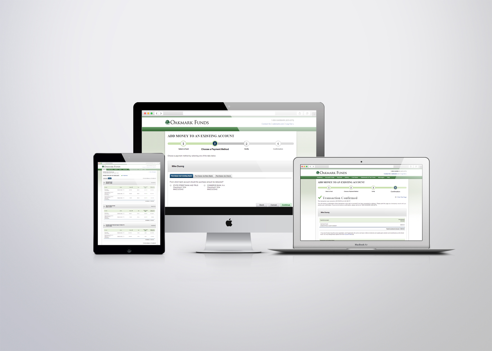
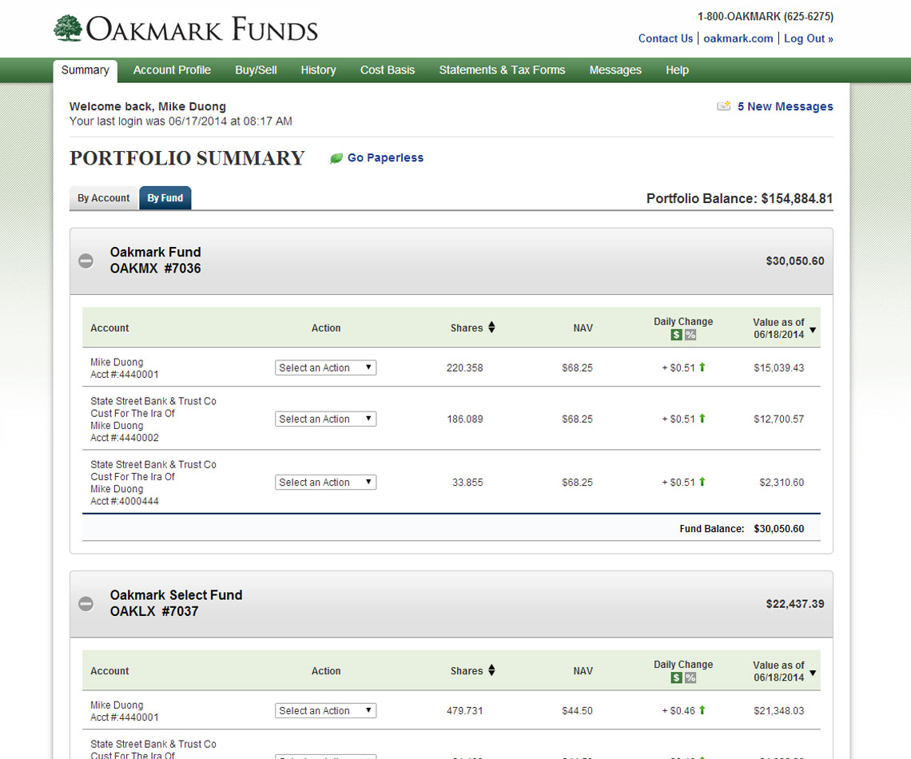
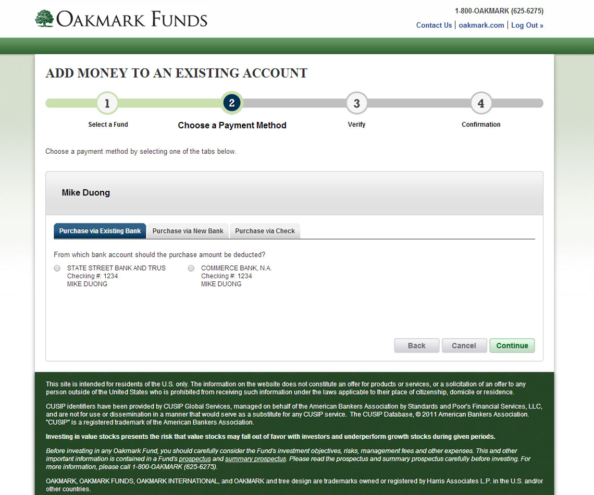

Second major project out of two major clients that were handled by Boston Financial Data Services web development division. Client ports already existed and were currently in use during development phases. Part of my time as a front-end developer for this project was incremental bug fixes and rolling out new design prototypes borrowed from the JPMorgan UI development project.

- Development platform: Internal Boston Financial Data Services web environments  
- Design: UI Elements by in-house designer at Boston Financial Data Services    
- Hosting provider: DST Servers  
- Project lifecycle: 9+ months  
- Website link: Internal project  

