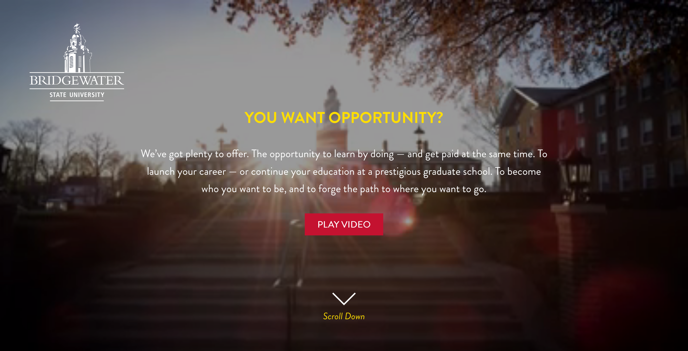
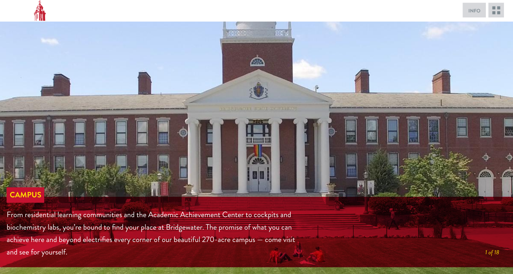
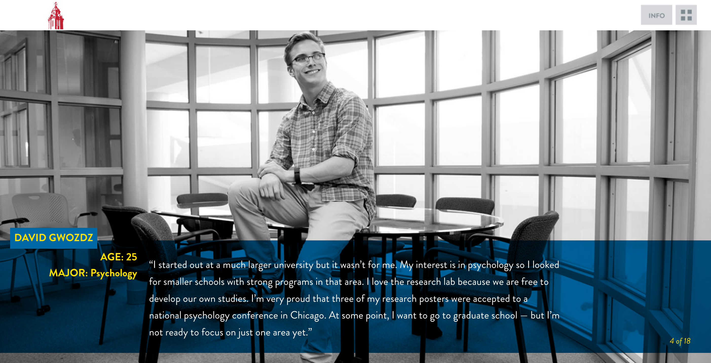

- Development tool: Drupal 8         
- Design: Designed by kor group  
- Hosting Provider: Bridgewater State University Server  
- Project lifecycle: 5 months  
- Wayback Machine Archive link: [Bridgewater State University Summer Campaign Microsite](https://web.archive.org/web/20190109153919/https://opportunities.bridgew.edu/)   

