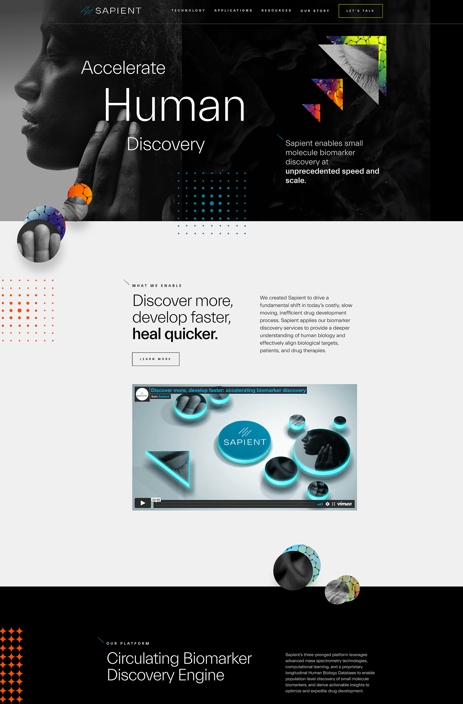
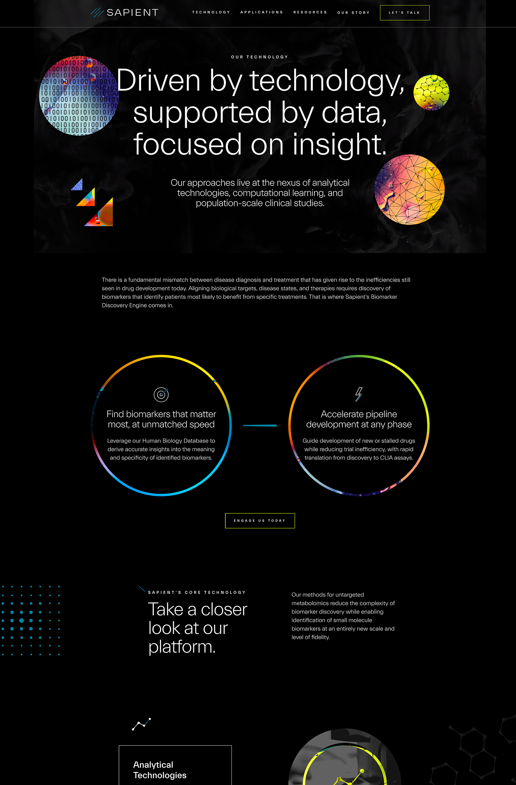
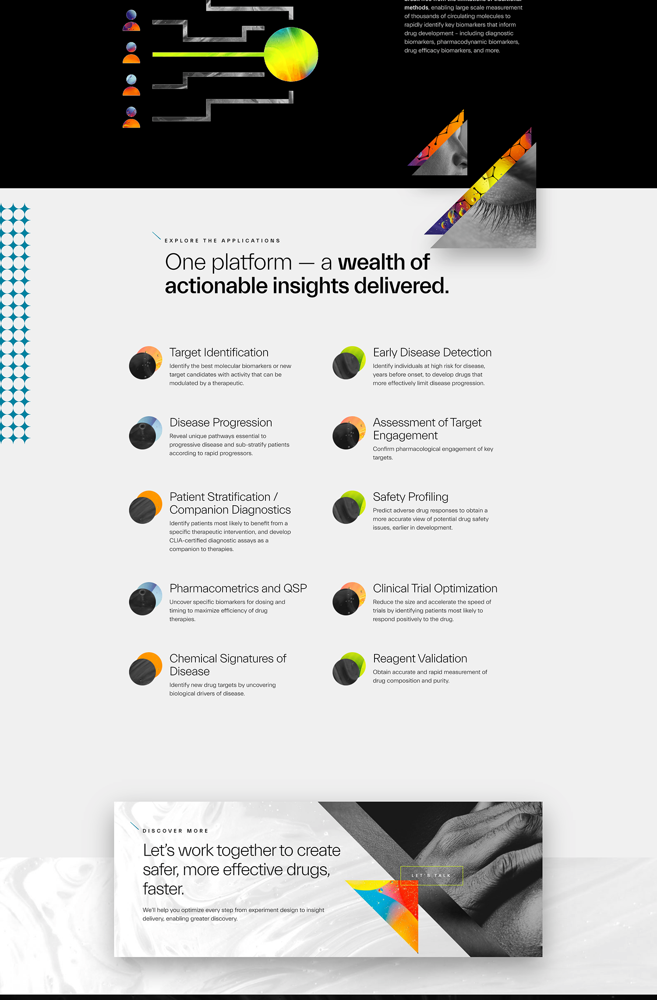
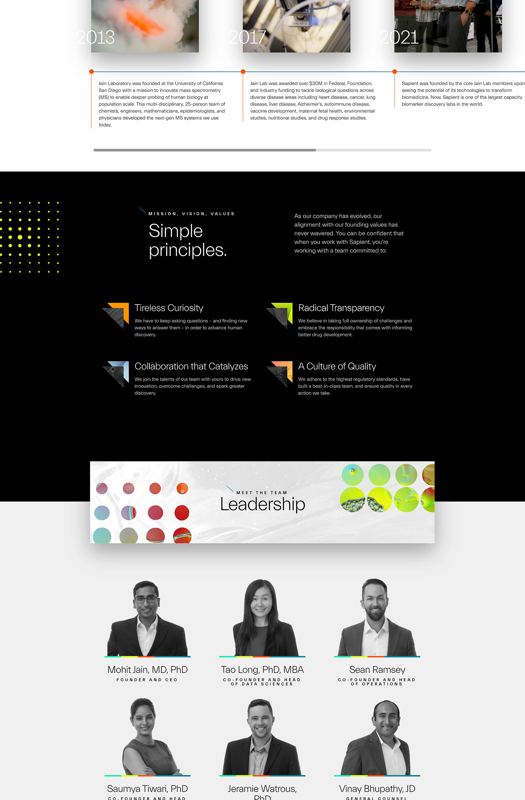
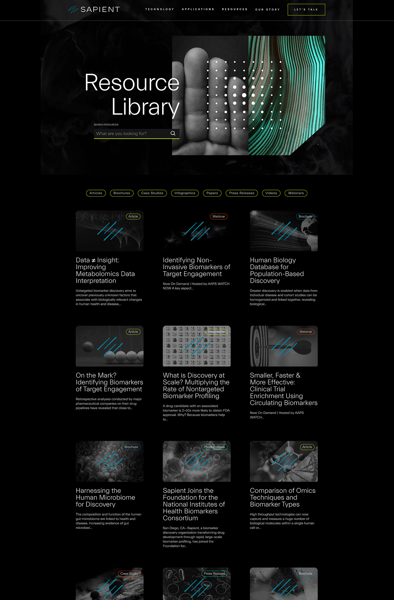
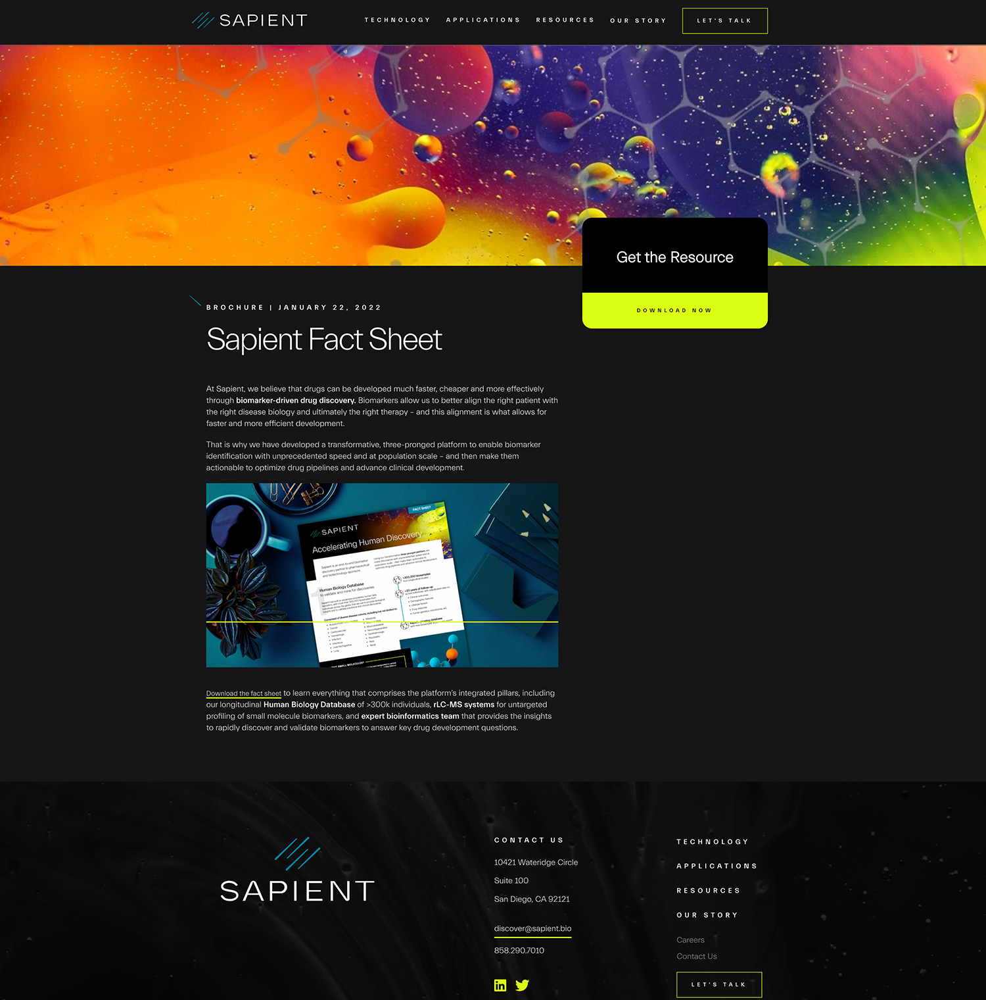

- Development platform: WordPress 5.9+ 
- Design: Site designed by [Image Conscious Studios](https://www.icscreative.com/)    
- Hosting provider: WPEngine   
- Project lifecycle: 3 months  
- Website link: [Sapient Bioanalytics](https://sapient.bio/)   

