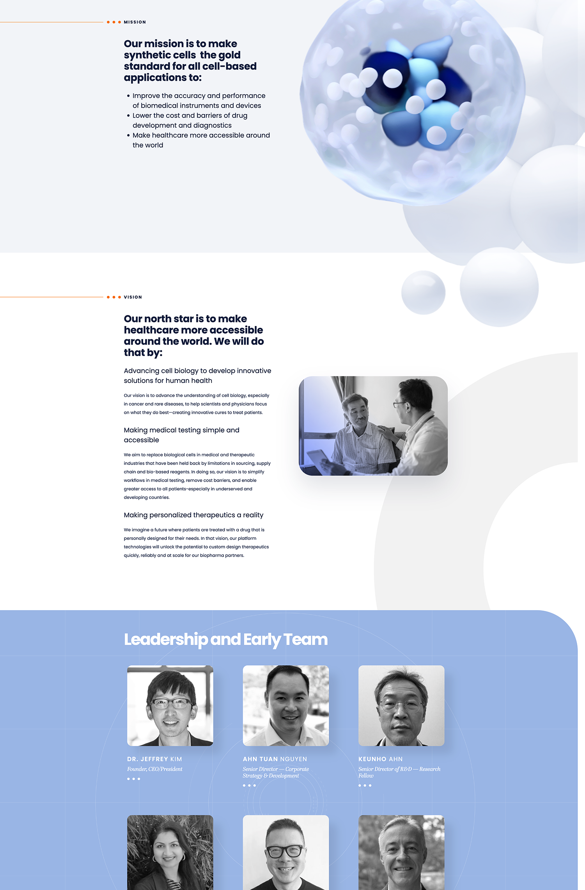
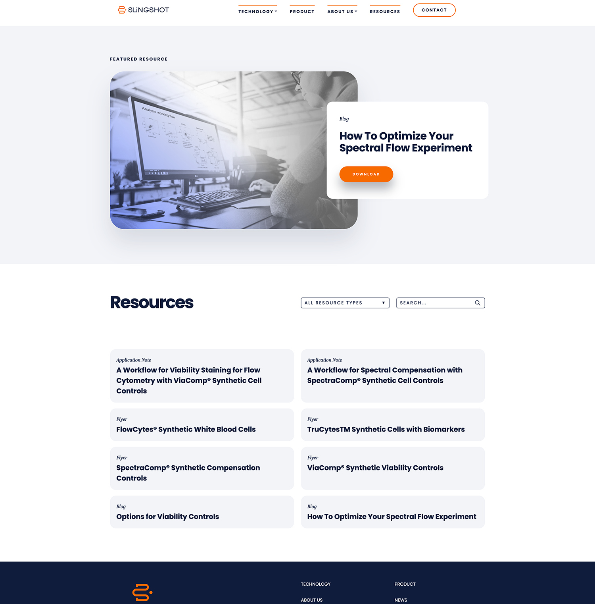

- Development platform: WordPress 5.9+ 
- Design: Site designed by [Image Conscious Studios](https://www.icscreative.com/)    
- Hosting provider: WPEngine   
- Project translations lifecycle: 3 months
- Project lifecycle type: retainer project  
- Website link: [Slingshot Biosciences](https://slingshotbio.com/)   

