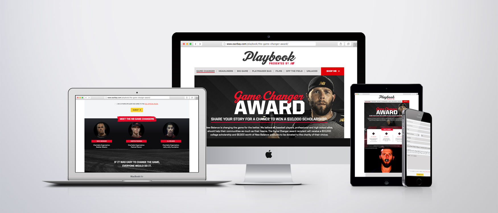
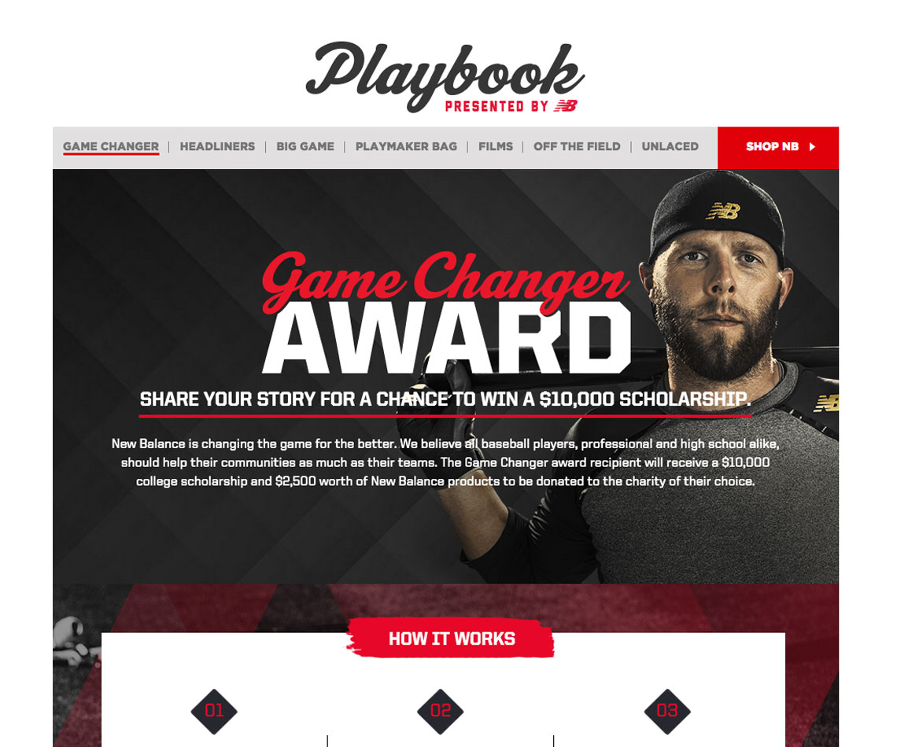
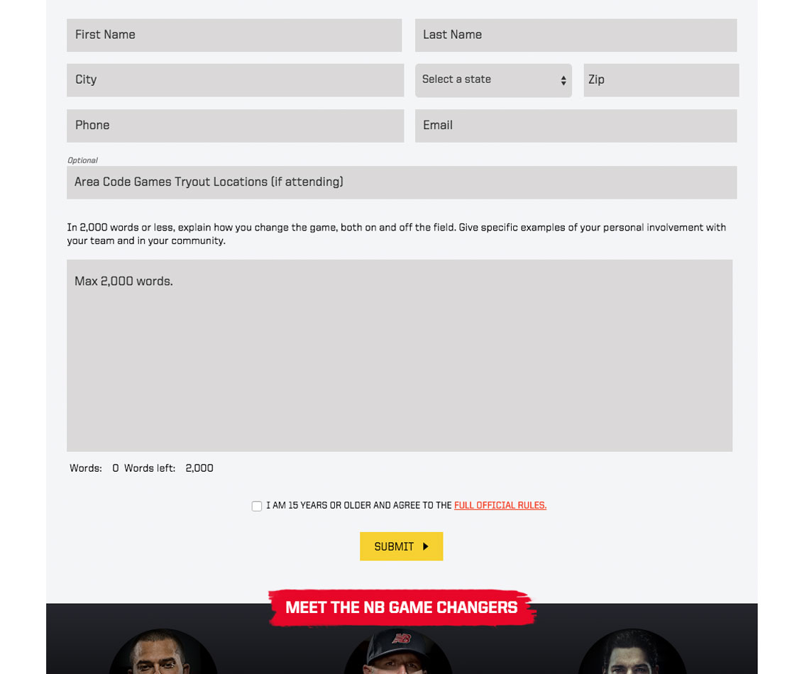
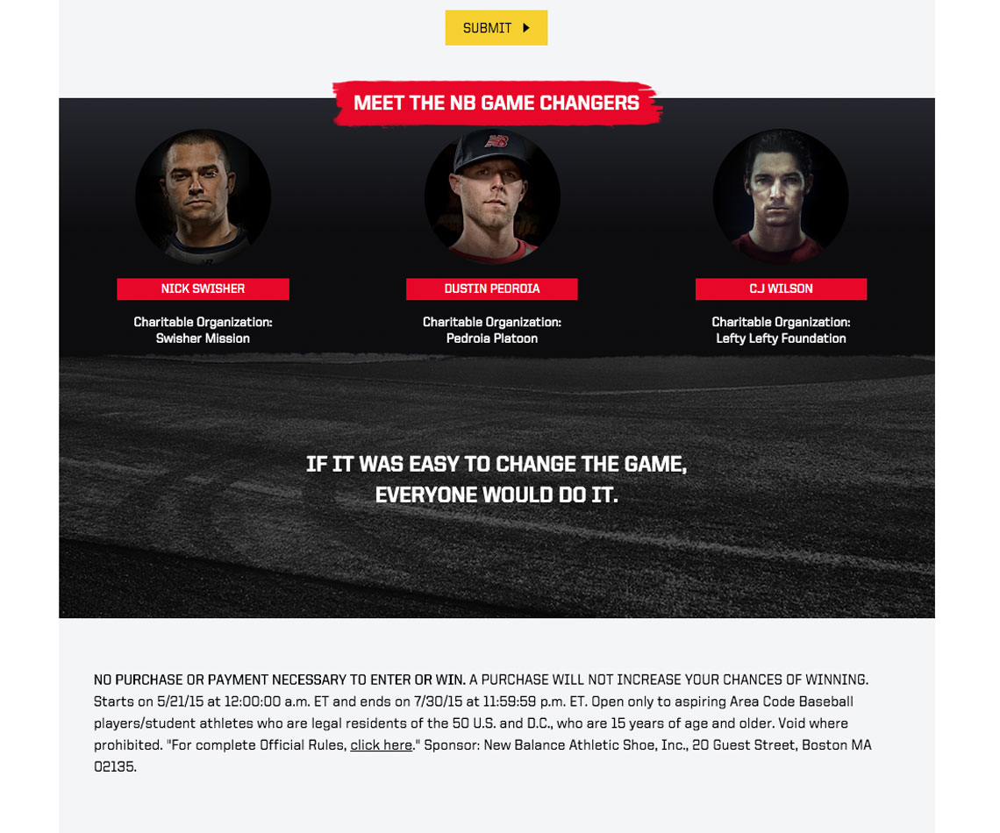

The Game Changer campaign was a partnership between New Balance and Eastbay specifically designed for high school students who wanted to earn a college scholarship and to make a difference in their community.

The campaign ran for about two months and was developed in WordPress. An iFrame method was implemented in order to maintain separation between Eastbay's main website and the New Balance campaign form.

- Development tool: WordPress   
- Design: Designed by Almighty 
- Hosting Provider: Eastbay proprietary AWS servers  
- Project lifecycle: 3 months 

