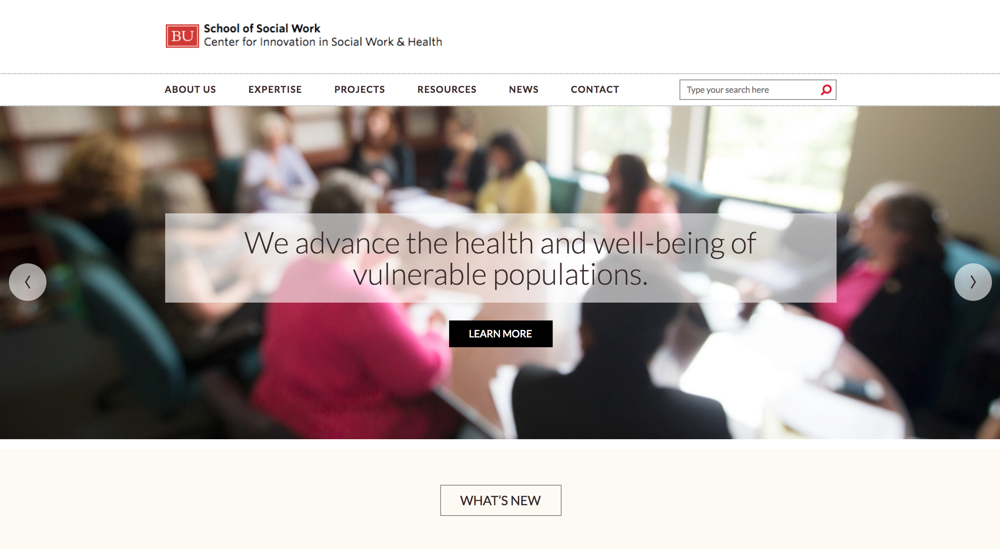
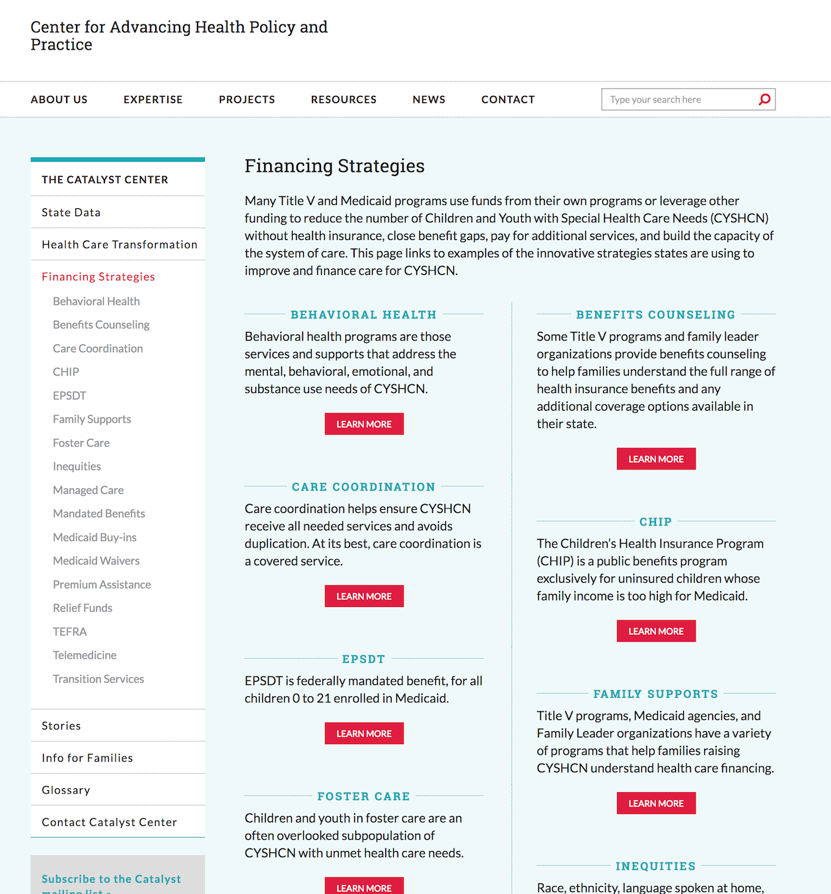

Boston University's School of Social Work has partnered with kor group for many years, developing countless print-based and web-based materials. The creation and overhaul of an archival site was just the latest project that was tasked to me when I was at kor. 

As the front-end developer, my role was to rebuild the user interface that held important faculty and student papers. Initially, the site was built on a WordPress platform, but the school quickly realized its drawbacks when it came across security and multilingual issues. The school later opted in for a Drupal-based approach instead. I worked alongside my colleague, who was a full-stack developer, on local builds, server management (AWS, BlueHost, Pantheon), and interactive elements for the site itself.

- Development tool:  WordPress/Drupal 8         
- Design: Designed by kor group  
- Hosting Provider: AWS/Bluehost/Pantheon  
- Project lifecycle: 10+ months  
- Website link: [https://ciswh.org/](https://ciswh.org/)   

