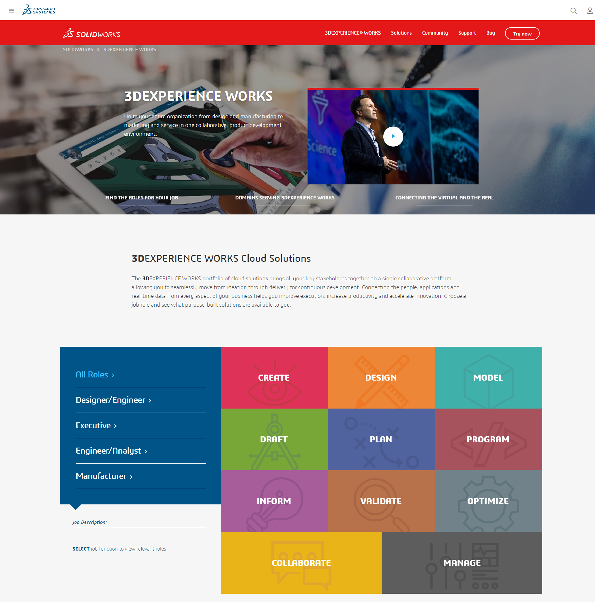
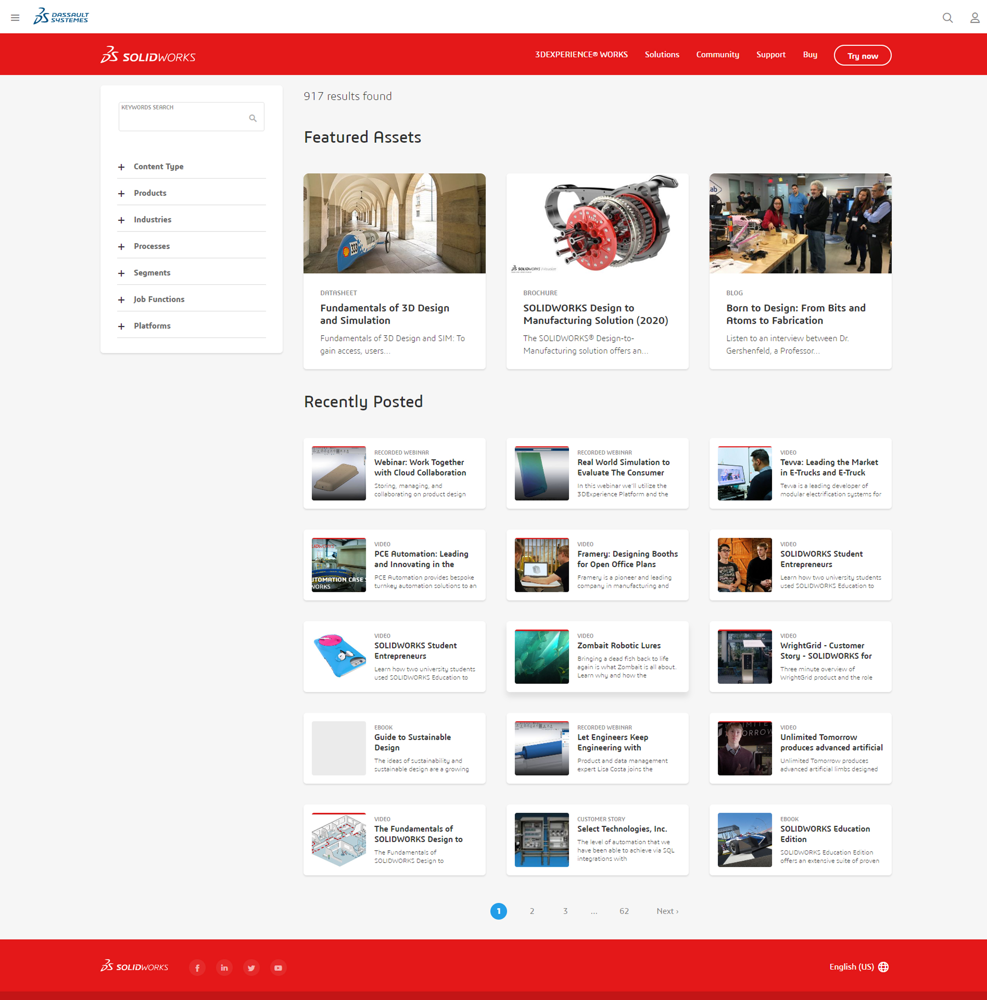

  
Development tool: Drupal 8.5+  
Design: Internal marketing designs  
Hosting Provider: Internal Servers and Akamai Technologies  
Project lifecycle: Ongoing  
Website link: [Solidworks](https://www.solidworks.com/)   

Dassault Systèmes is a software company based out of Vélizy-Villacoublay, France specifically focused on 3D modeling software for design, simulation, and manufacturing industries.

My positions falls specifically with the Solidworks product division, under the marketing department. Day to day tasks consists of Drupal 8 site maintenance. Collaborations work with backend developers on legacy site overhaul (Cold Fusion to Vue.js and Drupal headless method).

