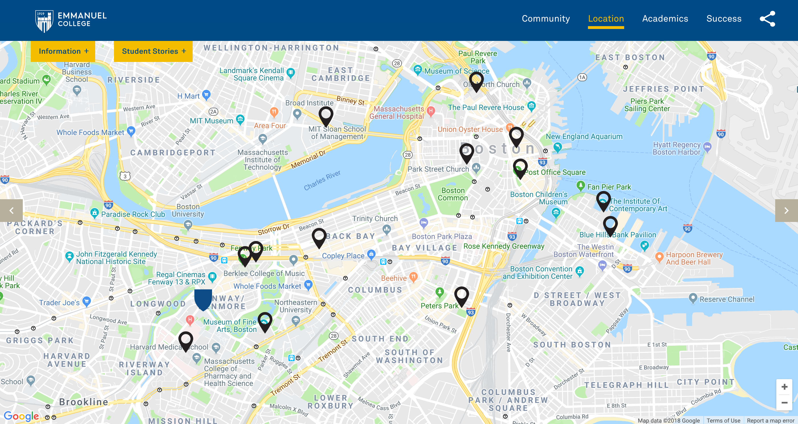
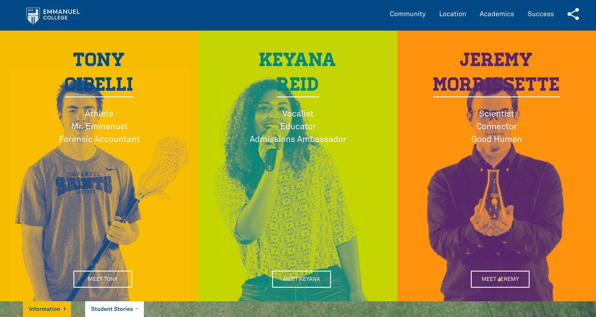

Emmanuel College is a 102-year private Catholic college in Boston, Massachusetts. Back in 2016, kor group was hired to help rebrand their marketing print and web-based material for 2017, two years before their 100th-year anniversary. As kor's front-end developer, I worked in parallel with kor designers in order to match print-based branding guidelines while coordinated with Emmanuel College's web department lead on the installation of campaign material. One such work was the Spring Enrollment Campaign for the fall of 2017.

Emmanuel College's website was built on WordPress and some minor departments in Drupal. The campaign needed to reside within the hero portion of the college's homepage. Because this was a direct embed of the files and the college carved out a directory with a specific URL path, the project didn't need to be installed within an iFrame method like most WordPress client-based campaigns.

The projected needed to be fully responsive from desktop to mobile. Unique jQuery elements to enhance the users experience along with an embedded Google Maps API section.

- Development tool:  Custom code (HTML,CSS,Bootstrap 3,JavaScript)   
- Design: Designed by kor group  
- Hosting Provider: Emmanuel College servers  
- Project lifecycle: 3 months  
- Website link: The only possible way to view older campaign work is from the Wayback Machine archive [Emmanuel College Spring Enrollment Campaign Link](https://web.archive.org/web/20180210205959/https://www.emmanuel.edu/go-all-in.html)   

