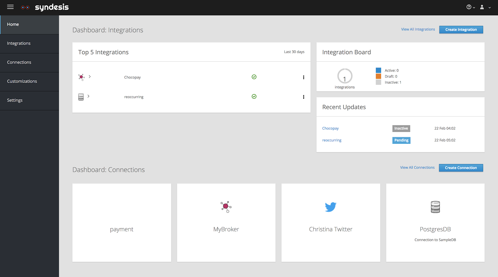
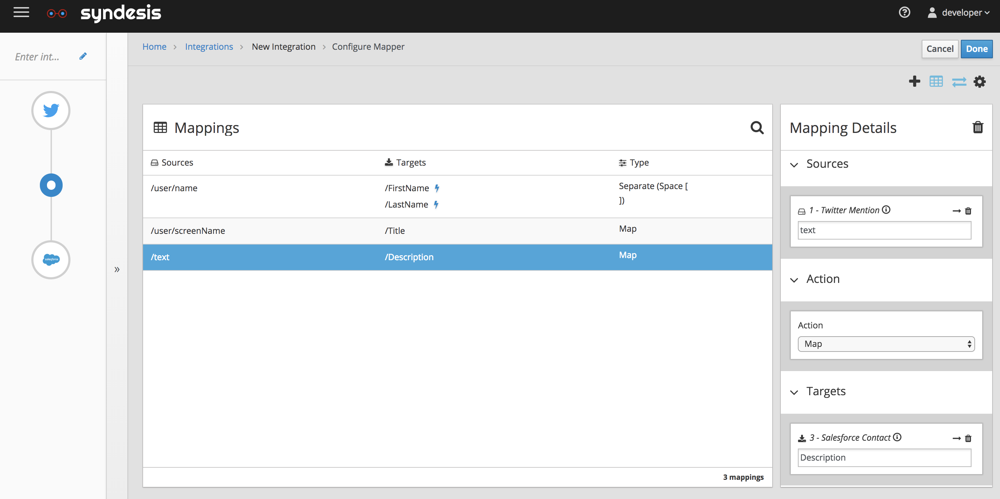
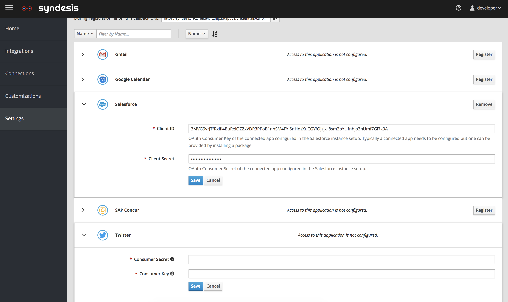
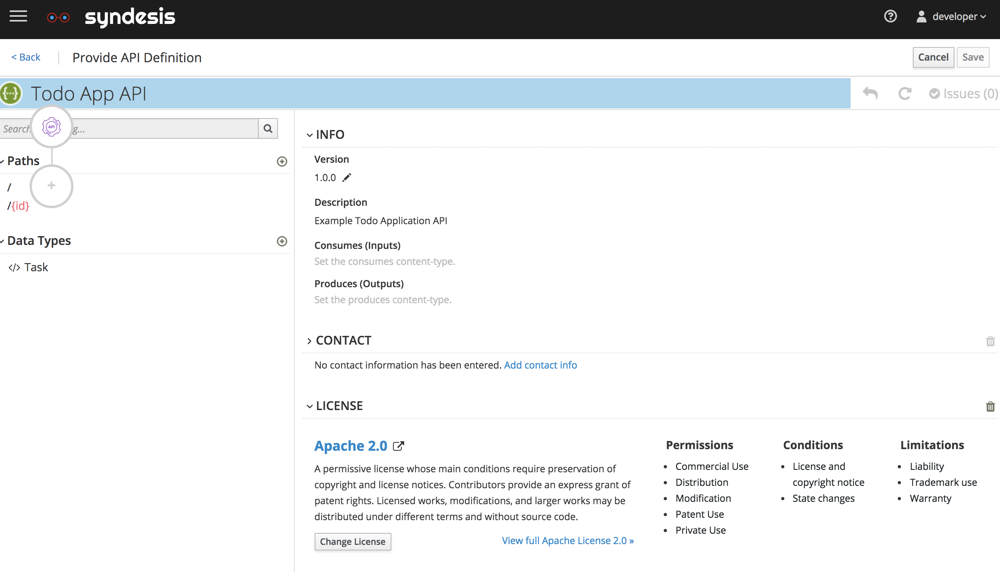
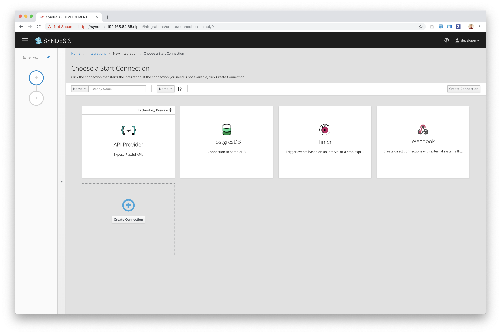
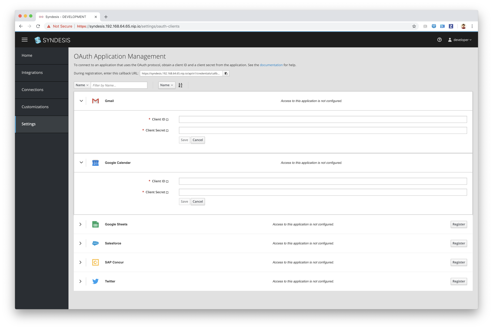

Red Hat is a multinational software company that provides open-source software specifically for enterprise-level companies.

As a UX front-end developer, my task was to build out new UI elements and debug current issues on existing software platforms on a three week sprint cycle. Most of the work were purely HTML, CSS, and vanilla JavaScript work, but on occasion I was paired with senior developers to working on React and Angular based projects.

- Development tool:  Custom code (HTML, CSS, Bootstrap 4, JavaScript, Angular, React)   
- Design: Designed by Red Hat UX/UI designers 
- Hosting Provider: Self hosting 
- Project lifecycle: continuous integration 
- Website link: [Syndesis Product Page](https://syndesis.io/)   

